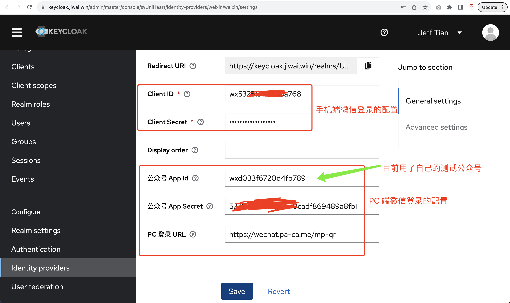

# keycloak-services-social-weixin

[English](README_en-US.md)

> Keycloak 的微信登录插件，尝试在 Keycloak 里打通整个微信生态。相关文章：《[对接微信登录的三种方式 - Jeff Tian的文章 - 知乎](https://zhuanlan.zhihu.com/p/659232648)》


[](https://github.com/Jeff-Tian/keycloak-services-social-weixin/packages)

## 在线体验

- [点击我并选择使用微信登录](https://keycloak.jiwai.win/auth/realms/UniHeart/protocol/openid-connect/auth?response_type=code&redirect_uri=http%3A%2F%2Fsso.jiwai.win%2Fkeycloak%2Flogin&client_id=UniHeart-Client-Local-3000)

## 如何使用

本项目是一个 Keycloak 的插件，所以你需要先有一个 Keycloak 实例，然后把本项目打包成 jar 包，放到 Keycloak 的 providers 目录下，然后重启 Keycloak 即可。即：

* Add the jar to the Keycloak server:
    * `cp target/keycloak-services-social-weixin-*.jar _KEYCLOAK_HOME_/providers/`

* 在生产环境下的keycloak，需要执行kc.sh build 注册provider


## 本地开发

需要 JDK 17 或者以上。

```shell script
mvn install
```

## 跑测试

```shell script
mvn clean test
```

## Maven 包

- 支持 jboss/keycloak 16，你可以使用我打的包：https://github.com/Jeff-Tian/keycloak-services-social-weixin/packages/225091
- 支持 quay.io/keycloak 18.0.2 的代码版本：https://github.com/Jeff-Tian/keycloak-services-social-weixin/tree/8069d7b32cb225742d7566d61e7ca0d0e0e389a5
- 支持 quay.io/keycloak 21.1 的版本：https://github.com/Jeff-Tian/keycloak-services-social-weixin/tree/dev-keycloak-21
- 支持 quay.io/keycloak 22 的版本： https://github.com/Jeff-Tian/keycloak-services-social-weixin/tree/dev-keycloak-22

## 获取 jar 包

### 直接下载

你可以从 https://github.com/Jeff-Tian/keycloak-services-social-weixin/packages 获取已经打好的 jar 包，可以省去打包的步骤。

### 手动打包

如果需要自己手动打包，可以在本地命令行执行：

```shell
mvn package
ls target
```

### 自动打包 

本项目使用 GitHub Actions 自动打包，只需要在 master 分支上提交代码，即可自动打包。但是注意，需要修改 pom.xml 中的版本号，否则打包出来的 jar 包版本号和已经打好的 jar 包版本号冲突，从而不能上传到 GitHub Packages。

## 发版

本项目使用 GitHub Actions 自动发版，只需要在 master 分支上打一个 tag，然后在 GitHub 上发布一个 release 即可。

## 配置截图

### Keycloak 16


### Keycloak 22



Client ID 和 公众号 App Id；Client Secret 和 公众号 App Secret 都可以是一样的，即通过手机或者 PC 的微信登录时，都使用同一个公众号。但是以上截图用了两个不同的，其中公众号 App Id 使用了我的个人测试公众号，在关注人数在 100 以内时可以使用。而手机端，则必须使用经过认证的企业公众号（特别感谢知友 [hhhnnn](https://www.zhihu.com/people/hhhnnn-78) 帮我提供，没有该服务号我没法调通手机端）。

## Docker 镜像

我也打包了一个包含[微信 idp 的 keycloak server docker 镜像](https://hub.docker.com/repository/docker/jefftian/keycloak-heroku)：

```shell script
docker pull jefftian/keycloak-heroku:latest
```

## 一键部署

### 部署到 Heroku

点击这个按钮，可以部署一个包含微信登录的 Keycloak 到你自己的 Heroku：
[](https://dashboard.heroku.com/new?button-url=https%3A%2F%2Fgithub.com%2FJeff-Tian%2Fkeycloak-heroku&template=https%3A%2F%2Fgithub.com%2FJeff-Tian%2Fkeycloak-heroku)

### 部署到 Okteto

[【免费架构】Heroku 不免费了，何去何从之 Keycloak 的容器化部署之路 - Jeff Tian的文章 - 知乎](https://zhuanlan.zhihu.com/p/611823061)

## 谁在使用

| URL                        | 说明                                           | 源码                                           |
|----------------------------|----------------------------------------------|----------------------------------------------|
| https://keycloak.jiwai.win | 我部署在 heroku 上的 Keycloak 实例                   | https://github.com/jeff-tian/keycloak-heroku |
| https://www.da-yi-jia.com  | 感谢[答疑家](https://www.da-yi-jia.com)对本项目的大力支持！ |

## 💵 欢迎问我！

有任何相关问题，欢迎来知乎咨询：

<a href="https://www.zhihu.com/consult/people/1073548674713423872" target="blank"></a>

## Release Notes

* 2022090
    - 适配 quay.io/keycloak 18.0.2

* 20180730
    - 增加自适应微信登录功能。
    - 账号关联默认使用微信unionid，如unionid不存在则使用openId
    - pc和wechat使用同一套账号则必须绑定同一个开放平台，否则会绑定不同账号
    - wechat信息非必填,默认使用pc方式登录

* 20200514
    - 增加 customizedLoginUrlForPc 功能。

* 20230820
    - 适配 quay.io/keycloak 21.1 的版本（由于 21 既不支持老的配置页，又没有新的方式增加自定义配置页，所以只能通过导入老的 Keycloak 版本中的 微信 identity provider 配置）

* 20230823
    - 适配 quay.io/keycloak 22.0.1 的版本，可以正常显示所有的配置了！[【重磅更新】关注微信公众号即登录插件升级支持 Keycloak 22！ - Jeff Tian的文章 - 知乎](https://zhuanlan.zhihu.com/p/652167012) 
* 20230827
    - 新增对微信开放平台的支持。 [【继续更新】尝试在 Keycloak 里打通整个微信生态 - Jeff Tian的文章 - 知乎](https://zhuanlan.zhihu.com/p/652566471)

## Star History

感谢大家的支持！

[](https://star-history.com/#Jeff-Tian/keycloak-services-social-weixin&Date)

## 致谢

- 感谢 [jyqq163/keycloak-services-social-weixin](https://github.com/jyqq163/keycloak-services-social-weixin) 提供的基础代码，本仓库从该仓库 fork 而来。
- 感谢 [hhhnnn](https://www.zhihu.com/people/hhhnnn-78) 提供的企业公众号，没有该服务号我没法调通手机端。
- 感谢[各位](https://github.com/Jeff-Tian/keycloak-services-social-weixin/graphs/contributors)发的 pull request 和 issue，让本项目越来越好！

## 原理

其实任何一个 OAuth2/OIDC 的登录插件都是一样的，都是通过一个授权链接，然后通过 code 换取 access_token，再通过 access_token 换取用户信息。详见《[三步开发社交账号登录（以钉钉登录举例） - Jeff Tian的文章 - 知乎](https://zhuanlan.zhihu.com/p/666423994) 》

### 以开放平台微信登录举例

#### 先构建授权链接

链接如下：

```
https://open.weixin.qq.com/connect/qrconnect?scope=snsapi_login&state=d3Yvfou3pdgp-UNVZ-i7DTDEbv4rZTWx6Wh7lmxzyvk.98VO-haMdj4.c0L0bnybTEatKpqInU02nQ&response_type=code&appid=wxc09e145146844e43&redirect_uri=http%3A%2F%2Flocalhost%3A8080%2Frealms%2Fmaster%2Fbroker%2Fweixin%2Fendpoint
```

用户使用微信扫描以上链接中展示的二维码后，会跳转到微信的授权页面，用户点击同意后，会跳转到我们的回调地址，并且带上 code 和 state 参数，如下：

```
https://keycloak.jiwai.win/realms/master/broker/weixin/endpoint?code=011er8000zwPzQ1Fvw200DTBCP1er80K&state=d3Yvfou3pdgp-UNVZ-i7DTDEbv4rZTWx6Wh7lmxzyvk.98VO-haMdj4.c0L0bnybTEatKpqInU02nQ
```

#### 通过 code 换取 access_token

#### 通过 access_token 换取用户信息